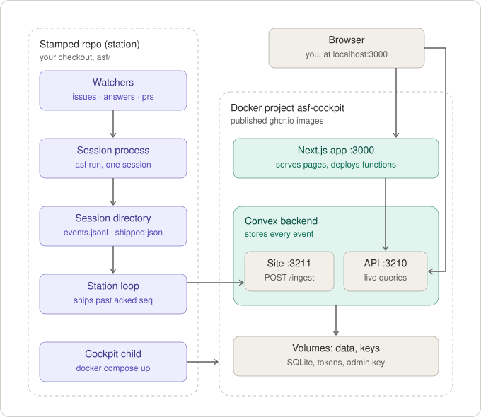
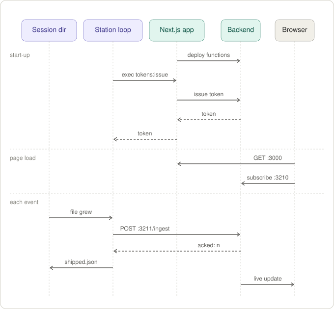

# The cockpit

Observes and steers many factories from one place (ADR 0001, spec #40). A station ships a session's
domain events to `POST /ingest`, and a sessions list and a session page render live from what was
stored. The home page is **Now**: the inbox of every gate the viewer may answer, answered in place,
then what needs attention, what is running and what waits on someone else, across every factory. The forge says which factories there are and who may see them: a Factories page lists every
repository the cockpit can reach whose default branch holds `asf/factory.yaml`. It is a Next.js
front end on a **self-hosted Convex** backend (ADR 0002), and it lives here, outside
`skills/agentic-sf/`, so it never ships in a stamp.

It runs in one of two modes, and the deployment's environment says which:

- **team** (the default): people sign in with a GitHub App the team registers for itself, and each
  sees what the forge lets them read. [Set up a team cockpit](#set-up-a-team-cockpit).
- **local** (`COCKPIT_MODE=local`): one person's own machine, started by `asf up`. Nobody signs in,
  and the forge is asked with that person's `gh auth token`.
  [Local mode](#local-mode-and-the-published-images).

## Run it

```bash
docker compose up --build        # backend :3210/:3211, dashboard :6791, app :3000
```

That is the whole setup. The backend runs on SQLite and local disk inside the `data` volume; a
one-shot `keygen` service derives the deployment's admin key from the backend's own secret, and the
app deploys its Convex functions with it every time it starts, so the functions and the pages are
always the same version. To log in to the dashboard, print the key:

```bash
docker compose exec backend ./generate_admin_key.sh
```

A factory is known to the cockpit by its repository. Give it an **ingest token** — factory-scoped
and append-only: it can add events to that factory's sessions and read nothing back. It is printed
once; only its SHA-256 is stored. Name the factory as its repository, `owner/name` (in any case):
that is what a viewer's permission is looked up by, so sessions shipped under any other name are
shown to nobody in a team's cockpit. One factory is stored under one spelling: a token takes the
one its factory already has here — an earlier token's, else the forge's — whatever case it was
asked for in, and a page that names the factory in another case reads the same sessions
(`convex/spelling.ts`).

```bash
docker compose exec app ./convex.sh run tokens:issue '{"factory": "acme/widgets"}'
```

## Set up a team cockpit

A team's cockpit has to be reachable by the people who use it and, for webhooks, by GitHub. Tell
the backend its public addresses before the first start — `CONVEX_CLOUD_ORIGIN` is where browsers
reach the backend's API (`:3210`) and `CONVEX_SITE_ORIGIN` where GitHub and stations reach its site
(`:3211`) — then register the GitHub App. There is one App per GitHub host (github.com, or your
Enterprise Server), and it is yours: private to your account, registered through GitHub's **manifest
flow**, so nobody copies a key by hand.

GitHub refuses to register an App whose webhook it could not deliver to: a loopback or private
address (`CONVEX_SITE_ORIGIN` left at `http://127.0.0.1:3211`, say). Such a cockpit — on one
machine for a trial, or behind a firewall GitHub.com cannot cross — is registered **without a
webhook**, and the setup page says so before you leave for GitHub. Everything else works the same;
the cockpit learns of the forge by the catch-up poll alone, once a minute. Sign-in needs only your
browser to reach the cockpit, so `http://localhost:3000` is fine for that.

1. Print a setup code. It is what shows you run the deployment; it works once, for an hour.

   ```bash
   docker compose exec app ./convex.sh run setup:code
   ```

2. Open `/setup` on the cockpit, enter the code, the GitHub host and the organization that will own
   the App, and continue. GitHub shows the App it is about to create; confirm it there.
3. GitHub sends you back, and the cockpit stores what it handed over: the App's private key, its
   client secret and (with a webhook) its webhook secret, in the backend's `forgeApps` table. No page or public
   function returns them.
4. Install the App on the repositories that hold your factories (the link is on the page you land
   on). An organization owner can; anyone else sends the owner a request from the same page.

People then **sign in** with the App (`/` sends them to GitHub and back). The cockpit holds each
person's user access token (8 hours) and refresh token (6 months) in the backend and hands the
browser only a token of its own, which it stores as a digest. What a person sees is what GitHub
says they can read: their permission on each repository is asked with their own token and kept (the
**permission mirror**), and the cockpit grants nothing itself. The Factories list, the sessions
list and a session page are all filtered by it. The page asks again every five minutes, and an
answer older than fifteen shows nothing at all until it has: a browser that stopped asking, or a
forge that cannot be reached, confirms nothing.

GitHub's answer is the repositories a person has been given access to — as a member, a team member
or a collaborator — through the App's installations. So a public repository is shown to the people
who have access to it, not to everyone with a GitHub account who signs in.

The App asks for what the cockpit does as the signed-in person (spec #40): `contents`, `issues` and
`pull_requests` write, and `metadata` and `members` read — the last so the forge can say whether a
person owns the organization a factory is in, which purging a whole factory takes. An App registered
before that was asked for has no `members` permission: add *Organization permissions → Members: read*
in the App's settings on GitHub, or purge a factory from the deployment's CLI (below). A user access token can do only what both the person
and the App may, so the App's permissions are a ceiling, never a grant. Registering again with a
fresh setup code replaces the App and signs everyone out — the way out of a registration under the
wrong account.

### How the cockpit learns of the forge

- **Webhooks.** The App has one webhook for every repository it is installed on, delivered to
  `POST /forge/webhook` on the backend's site. A delivery is checked against the webhook secret
  (`X-Hub-Signature-256`), handed to a mutation and answered at once; the forge is asked nothing
  until after, because GitHub waits ten seconds and never retries. A push to a default branch has
  the cockpit look at that one repository again; a change to the installation or to a repository
  has it list them all.
- **The catch-up poll.** `discovery:catchUp` runs once as the deployment starts and every minute
  after, and finds whatever a delivery that never arrived would have said. It lists the
  repositories with ETags — a `304` costs nothing against the rate limit — and asks a repository
  whether it holds a factory only when it was pushed to since the last look. A repository the forge
  will not show the cockpit (gone, blocked, behind an organization's SSO) is not a factory here.
  Then it asks every factory which of its open issues carry the queued label and a route label —
  the work an issues watcher would start (`discovery:queues`) — every round, since a label changes
  no push, and with ETags, so a round where nothing was labelled is all `304`s. Last, it asks each
  factory with a session where its issues and pull requests stand — open, closed, a draft, merged —
  which no event says, since a pull request is merged long after the session that opened it ended
  (`discovery:items`). That is one listing of what changed most recently, again with an ETag, so a
  quiet round is one `304` a factory; it pages back only when more changed since the last look than
  a page holds, and the first look goes back to a day before the factory's oldest session. What it
  finds is kept in `forgeItems`, and every icon of an issue or a pull request is drawn in it: one it
  has not read is drawn in no state, as before.
- **Rate limits** are read from the response headers, never assumed: an Enterprise Server has them
  off unless its admin turned them on. The poll leaves a quarter of a budget untouched, stops when
  it gets there, and carries on when the limit resets; the Factories page says so meanwhile.

What the cockpit reads for itself goes on the App's installation token; what it asks about a person
goes on that person's token. Both are behind one interface, `convex/forge/forge.ts`, with the App
in `convex/forge/app.ts` and local mode's token in `convex/forge/token.ts`.

A session's **repo artifacts** are read that way too. A handoff file (findings, a review, the
issue a chapter answers) travels inline in its `artifact_written` and is on the page already; a
repo file (the spec, the doc) travels only as a path, because it is committed on the session's
branch. When a person opens a phase's Artifacts tab, `artifacts:read` asks the forge for the file at
the sha of the first `committed` after it — the factory commits the whole tree, so that commit holds
it as written — and never at the branch tip, which later phases and people move on. It checks the
bytes against the digest the phase shipped, cuts them at the factory's own cap (256 KB), and keeps
nothing: the cockpit stores no file bodies. The page says when a later commit changed the file (with
a link to the forge's comparison), and when a later phase wrote it again before anything committed
it, so that version never reached the forge. The session must be one the person may see; the read
itself goes on the installation token, like the cockpit's other reading.

## Now

The home page, `/` (#115, `convex/now.ts`), is one query for the viewer across every factory the
permission mirror lets them read, in four sections. The **Inbox**, which never folds, is the gates
waiting on them (below). **Needs attention** is the attention rule (`model/attention.ts`)
gathered across factories, less the gates the Inbox already holds: each row names its next step and
goes there — Open a failed session, Release a claim, Compare a drifted station, See config for a
failing check, Stations when nobody watches; the steps that belong on a factory's tab go to that tab
(`?tab=stations`, `?tab=config`). **Running** lists every session running now with the stage it
is in, a mini stage graph, and what it spent and for how long — that graph is the session's events
folded, a query of its own per row (`sessions.progress`), so one long record weighs on its row
alone. **Waiting on others**, folded at first, is the gates waiting on someone else and on whom; each
opens in the same drawer, which says why it is not the viewer's. Three judgements are the page's, by
its clock, as constants beside the attention rule: a phase running over 10 minutes is "17m in
verify" in amber, a spend from 80% of the factory's per-session ceiling is "$0.21 of $0.25" in amber,
and a wait over 30 minutes reads amber. The header's Now carries the count of gates waiting on the
viewer from every page (`inbox:count`), and nothing at zero. `/?factory=<owner>/<repo>` narrows every
section to that factory's.

### The inbox

The Inbox lists every gate, across every factory, that the viewer is **permitted** to answer:
they can read its repository, and the factory's trust list for the wait's channel names them or
nobody. That list is the factory's own word, carried by the `suspended` event (`trusted`, from
`issues.trusted_authors` for a wait on an issue), so the cockpit offers the answer to exactly the
people the factory will hear. The rows that are **for the viewer** — a run they triggered, an issue
they wrote, an issue assigned to them — are marked and sorted first; it is a ranking, never a filter,
so every row the viewer may answer stays. Who triggered a run is the factory's word
(`session_started`'s `triggered_by`: whoever labelled the issue, or the operator who ran it), and the
issue's author and assignees ride on `provenance_recorded` v2. The rest wait longest first. A row opens its gate in **the drawer** over Now (#113), and
the address says which (`/?open=<owner>/<repo>/<session>&tab=…`), so a link opens exactly that gate;
the session page's Now card opens the same drawer, its button the page's only one for a gate, as
does the waiting gate's phase in the graph (`?gate=<phase id>`). The drawer asks the question as its
title, under the session's title, how long it has waited and where; from round 2 the round before's
verdict and the person's own note; every ⚑ flag an agent filed in the chapter; and tabs by the gate's
kind, which is its name — a plan gate's plan, the issue in the reporter's words and the scout's
findings, opening from round 2 on "Changes since round N−1" (#114); an integrate gate's changes,
checks, review and issue; a question round's questions; any other gate's subject (`convex/model/gate.ts` reads all but the subject off the session's events).
Its footer answers it: notes with the gate's own placeholder, Reject (Send back at integrate)
refusing an empty note because the next agent reads it as an instruction, the primary Approve plan
(Open pull request), and a quiet Abort session. Answered, it moves to the next gate that can still
be answered, or closes; an answered gate says what was answered and where the comment is, and a gate
waiting on someone else says whom — whoever can read the session sees it, and the factory hears only
the people its trust list names. The list and the open gate are live queries.

## Triggering a workflow

A factory's page has a **Trigger** button in its header: pick a workflow and an issue, and the
cockpit adds that workflow's route label and the factory's queued label to the issue **as the
viewer** — on their user access token in a team cockpit, or the local cockpit's `gh auth token`.
Nothing is started here: the factory's issues watcher dequeues the issue on its next poll, as it
would one labelled on the forge, and records whoever the forge's `labeled` event names as the run's
trigger. The button is enabled from **triage** up, which is what the forge asks of a labeller, and
otherwise disabled with the reason; the forge is what enforces it. A closed issue, a pull request, a
label that routes nothing, an issue already queued (no new `labeled` event would name the viewer) and
one a run already has (a run parked at a gate keeps it on `running`; queueing it again would start a
second) are refused before anything is labelled (`convex/trigger.ts`).

The cockpit never reads a factory's config to learn its routes (#26: only the factory's own code
does). It finds them on the forge: `asf labels --create` describes each route label as `asf route: a
person asked for the <workflow> workflow here` and the queued label as `asf: waiting for a watcher to
claim it`, and `convex/model/trigger.ts` recognises those two descriptions — `tests/golden/labels/`
holds them (and the running label's), and both suites read it. A label made by hand says nothing,
and is not offered. The forge's labels are not the factory's config, though: a route removed from
`issues.route` keeps its label, and is offered until someone deletes it — the watcher then leaves an
issue carrying only that label queued. The self-description is where routes belong once a
factory ships one.

An answer is a **comment on the work item, posted as the viewer**: on their own user access token
in a team cockpit (GitHub shows it as theirs, made through the App), or with the `gh auth token` a
local cockpit holds. Its first line is the verdict the factory's answers watcher reads — `/approve`,
`/reject <notes>`, `/abort`, or a question round's answers in prose — and it ends with a mark naming
the session, gate, round and subject digest it answered, so the watcher ignores it once the run has
moved past them (`convex/model/answer.ts`). Nothing in the cockpit records a decision: the row says
"answered" until the session's own events close the wait. `tests/golden/answers/` holds each
rendering; this suite renders them byte for byte and the factory's proves its watcher hears them.
What the factory would refuse — a reject without notes, an answer at a gate, a reject at a question
round — is refused before anything is posted, and so is an answer to a round or subject that has
moved on since the view opened.

The drawer reads the subject from the forge at the commit the question was asked about
(`head_sha`), never the branch tip: the files, which it hashes the factory's way to say whether they
are still what was asked about, or — for a subject the station alone holds, such as the integrate
gate's diff — the forge's comparison of `base_commit` with `head_sha`. What changed since a plan's
round before is the forge's comparison of the two rounds' `head_sha`, cut to the plan's own files
(`inbox.sinceLastRound`); those commits are on the forge only under `worktree.publish: on_create`,
and without them the tab is absent and the drawer says why. A wait on no work item — a
run started from a prompt, on the terminal channel — is answered by a **command** to its station
instead (see below): the view says so ("sends a command to `alex@mbp` as you") and whether the
station is listening ("resumes when `alex@mbp` is back online"). Rows that cannot be answered here
stay, disabled, with the reason: a wait on a pull request (nothing reads those yet), a subject not
on the forge (`worktree.publish: on_integrate`), a gate on an issue being asked at the station's
terminal, an answer already given, a station that takes no answers. Keys: `j`/`k` next and previous
(the gates either side, in the drawer), Enter to open, `a` approve (at a question round, take every
recommendation), `r` reject — none of them while typing.

## The ingest wire

A station sends one session's lines of `events.jsonl`, unchanged, to the backend's **site** origin
(`:3211`, `CONVEX_SITE_ORIGIN`):

```http
POST /ingest
Authorization: Bearer asf_ingest_…
Content-Type: application/json

{"session": "5c0075aa", "events": [{"seq": 1, "ts": "…", "kind": "session_started", "v": 1, "payload": {…}}]}
```

```json
{"acked": 1}
```

- Each event is stored as one document keyed by (factory, session, `seq`). The factory comes from
  the token, never from the body.
- `acked` is the highest `seq` with every `seq` below it stored: what the station resumes after. A
  batch with a gap is stored, and `acked` catches up when the gap is filled.
- A batch holds at most 500 events and 4 MB of payload (one event at most 900 KB); a bigger one is
  refused with `413` and nothing of it is stored. A station sends a backlog as several batches.
- Resending is harmless. A `seq` already stored is skipped, never overwritten, because a `seq` means
  one line forever.
- No event is refused for its kind or version. One this cockpit has no reader for (an unknown kind,
  or a `v` newer than it reads) is stored raw, shown as a generic row, and counted in the "upgrade
  the cockpit" banner. `401` is for a missing or unknown token, and `400` is for a body that is not a
  batch. Neither says anything about the events. A payload is stored as the JSON text it arrived as,
  so no key a factory writes can make an event unstorable.

## Ship from a station

A stamped factory ships on its own once its `.env` (or a CI job's environment) names the cockpit:

```bash
ASF_COCKPIT_URL=http://127.0.0.1:3211      # the site origin, not :3210
ASF_COCKPIT_TOKEN=asf_ingest_…
```

Every `asf run` then ships its session from a background thread as it goes, and `asf station sync`
sends whatever the cockpit has not acknowledged, for every session in the checkout. That is a CI
job's last step, and the way to catch up after the cockpit was down. The station keeps the
acknowledged `seq` per session and resends from there, so nothing is lost while the cockpit is
away. The factory's half is `engine/station.py` in the skill's templates.

A manual smoke test, with the stack up and a token issued:

```bash
cd /path/to/a/stamped/repo                 # fake harness: see tests/asf_helpers.fake_roster
echo "ASF_COCKPIT_URL=http://127.0.0.1:3211" >> .env
echo "ASF_COCKPIT_TOKEN=asf_ingest_…" >> .env
uv run asf/asf.py run quick "add a health check"   # appears on :3000 within seconds
```

## Commands: register a station; kill, resume, answer and run

A station takes commands — the steering the forge cannot carry — once a person approved it. In a
stamped checkout, with `ASF_COCKPIT_URL` and `ASF_COCKPIT_TOKEN` set:

```bash
uv run asf/asf.py station register       # prints a code, and /stations/approve?code=… to open
```

The person opens that page signed in (write on the repository), approves, and the station's next
poll of `POST /station/register/poll` is handed a command token: theirs, for that station alone,
kept as a digest here (`convex/stations.ts`). The link is built from `COCKPIT_APP_URL`, which the
compose file passes to the backend; without it the station names the Stations page instead. A local
cockpit issues its station that token itself (`stations:local`, through `docker compose exec`).

The station loop and every run's own shipper then `POST /commands` every few seconds with it
(`convex/commands.ts`). Each poll says what the station would obey and where its checkout stands,
and is all the liveness there is: a session is attended while its run polls, a station online while
its loop does. A command goes to the run while it is attended and to the loop otherwise, waits for an
offline station as long as its verb's TTL (`TTL` in `convex/model/command.ts`; a cron expires what
nobody took), and is done only when the station's `command_result` arrives — through `/ingest` in
the session it names, or, for a run, which names none, in the `results` of the station's next poll,
which settles only that station's own commands. Revoking a token under Stations makes its polls
`401`. The factory's half is `engine/commands.py`.

- **kill** a running session and **resume** a failed one, from the session page's top bar, on the
  station that holds it. A session that ran in CI (`session_started` v2's `station_kind`) has no
  station to resume it: "ran in CI: re-trigger from the forge".
- **answer** (approve, reject, a question round's answers) and **abort** a gate on no work item,
  from the inbox. The command names the gate, round and subject digest the person was shown, and
  the station refuses it once the session has moved past them or the round has a decision.
- **run** a prompt workflow, from **Run a prompt** in the header on every page: one dialog,
  opened on the factory in view (a factory page, a session's factory, a sessions list filtered to
  one), offering only that factory's prompt workflows as its self-description names them. A
  workflow's Run on the Workflows tab opens the same dialog on that workflow, and the retired
  `/run` sends a person back where they came from with it open. A run goes only to one of the
  asking person's own stations — their most recently seen, or another of theirs when that one
  would refuse it, which the dialog names — and the station takes it only from the person it is
  registered to.

Each verb is the station's to obey: its `asf/factory.yaml` lists it under `cockpit.commands` (`run`
is off unless listed), and the cockpit greys out what the station's report says it would refuse.

## Claims: which station starts a work item

The forge label is not a lock: it has no conditional edit, so two stations' watchers that listed
the same queued issue both flip it (ADR 0003). So a station asks this cockpit first. `POST /claims`
with the factory's ingest token, `{op: "take", repo, kind: "issue" | "pr", number, session, since,
station: {id, name}, requeue: {add, remove}}`, is one mutation (`convex/claims.ts`): `200
{granted: true}` for the first session that asks and for that session on that station again, `409
{granted: false, held: {station, name, session}}` for anyone else, and `409 {granted: false,
abandoned: {session, by}}` for a session a writer released a claim of — a resume asks, so an
abandoned session cannot carry on beside the run that took its item afresh. `op: "drop"` gives back a claim
no session used, and only the station's own.

Ingest frees a claim when its session's events after `since` say the run finished, or was aborted
(`convex/model/claim.ts`); a failure keeps it, so the session can be resumed, and nothing frees one
by the clock — a station offline is a laptop asleep, not a dead one. The session page shows each
claim the session took, the station holding it and how long that station has been away, and offers
a writer **Release claim**: it is let go at once, recorded as theirs, the session abandoned, and the
item relabelled as the claim says (`requeue`, the factory's own label names: an issue back on
`asf:queued`, a pull request without `asf:pr-failed`), as them. A forge that will not relabel
leaves the claim released, and the page says to relabel by hand.

A local cockpit is one person's and grants nothing: a factory claims only from a shared one
(`ASF_COCKPIT_URL`). The factory's end is `engine/claims.py`.

## The Factories list: what needs attention first

`/factories` ranks the factories the viewer can read, drawn with Now's rows: those that need
attention first — the same facts as Now's Needs attention, from the same `attentionOf` —
then the most recently active, then the rest by name (`convex/model/factories.ts`). Like the Factory
page, the ranking is read against the page's clock, so a failure stops ranking its factory first a
day after it ended. Each row says what needs the viewer — the **gates waiting on them**, a **failing
check**, and how many other things need attention (a failure in the last day, a claim whose station
has been offline over a day, drift, nobody watching), which its page and Now name — then what is
moving: sessions **running** (not suspended), its **stations online** of all that registered, and
the **workflows** its default branch's self-description loads. On the right are its **spend** this
month, a calendar month in the viewer's own timezone (`convex/model/period.ts`), list-price
equivalent, and when it was last active. A row opens its factory, whose header holds **Trigger…**.
Drift there is measured against the commit the default branch's last check ran on, since a query
cannot ask the forge; the Factory page measures against the forge's tip.

Spend comes from the `usage` events: ingest adds each agent call's cost and tokens to a row per
session, quarter hour and **charge** (`spend`, `convex/model/spend.ts`) as the event becomes
contiguous, so once however often a batch is resent. A call is charged to what was running when it
was made — the workflow of its chapter, the station that ran it, the person who triggered the run —
so a session that went on into a pull request's review spends in both workflows. Every timezone in
use is offset from UTC by a multiple of fifteen minutes, so a period starting at any viewer's
midnight takes whole rows.

Each phase is kept the same way, one row a phase (`phases`, `convex/model/phases.ts`), folded as its
events become contiguous: its chapter, workflow and stage — by the stage index its `phase_started`
v3 carries, none for the work item, the report or a factory before stages — its kind and status, the
time its live runs worked (a replay works none), what its agent calls cost, and, for a round a person
was asked at a gate, their verdict and how long it waited for it. A gate the policy passed asked
nobody, and is no row. Sessions an older cockpit stored are written from their first event by
`phases:backfill`, which `docker/start.sh` (and a Vercel production build) runs after each deploy, or by their next batch if it comes
first.

## Cost: who spent, and who asked

`convex/cost.ts` rolls one factory's spend up by **workflow**, **station** — whose machine and key
paid, so it names the station's owner, the person who registered it — and **person**, who triggered
the run. The two differ whenever
a teammate's label is picked up by your watcher: your station paid, they asked. A factory's Overview
reads it over the last 7 or 30 calendar days in the viewer's own timezone (`lastDays` in
`convex/model/period.ts`); `/cost`, which once showed it across factories, goes on to the Overview of
the viewer's one factory, or to the Factories list. Every amount is labelled **list-price
equivalent** — what the tokens would cost at the provider's list price, subscription or not — with
the tokens alongside.

A factory is summed under every spelling its rows were stored under, as the Factories list sums
it. One roll-up sums at most `SUMMED` rows (a quarter hour a session and charge): a range long
enough to pass it is refused with "pick a shorter period", never summed in part.

No budget is shown there, because none exists per period or per factory: the factory enforces
`budget:` per session only. The configured ceiling is in the Factory page's header and Workflows
tab, from the factory's self-description, and each session page shows its spend against it, in
money and in tokens — or says the ceiling is unknown when no `asf check` reached the cockpit.

A local cockpit that knows one factory skips the list and opens its Factory page; a second factory
brings the list back. A team's cockpit always shows the list.

## Retention: what is kept, and for how long

Every event a station ships is one of three weights (`convex/model/retention.ts`): **core** — phases,
gates, decisions, spend, commits — kept forever; **handoff** bodies — an artifact's content, a
command's output tail — kept until someone purges them; and the **transcript** — `prompt_rendered`
and `harness_output`, which a factory sends only when it opted in — which **ages out**. Aging out and
purging both replace an event's body with `pruned: {on, reason: aged_out | purged, by?}`; the event
and its seq stay, so every view but the Transcript tab rebuilds exactly as before
(`tests/pruned.test.ts` holds the cockpit to that), and the Transcript tab says "transcript aged out
on 3 Oct 2026".

A transcript ages out once its session has been finished for `COCKPIT_TRANSCRIPT_DAYS` days (30
when unset; `docker compose` passes it through). A factory's `cockpit.transcript_retention_days` can
only shorten that: each session carries the value it ran under (`session_started` v3), and the lower
of the two applies. The clock starts when the session finishes, and a resume stops it. An hourly
cron prunes what is due (`convex/retention.ts`); `docker/start.sh` re-dates every held transcript as
the deployment starts, so a changed `COCKPIT_TRANSCRIPT_DAYS` takes effect with the restart that
sets it. A local cockpit has the same default, which its owner raises with
`ASF_COCKPIT_TRANSCRIPT_DAYS` in the factory's `.env`.

Purging is always somebody's decision, and nothing is purged on its own — not when a repository is
deleted, not when the App is uninstalled:

| purge | who | where |
|---|---|---|
| a session's bodies — every artifact's content, command output and transcript | an admin of its repository, as the forge says (the permission mirror) | the session page's ⋯ menu |
| a whole factory's bodies | an owner of the account its repository belongs to, asked of the forge as the person | the Factory page's Config tab |
| the same, with no forge permission left | whoever holds the deployment's admin key | the CLI, below |

```bash
docker compose exec app ./convex.sh run retention:purgeFactoryFromDeployment \
  '{"factory": "acme/widgets", "reason": "the repository was deleted"}'
```

On a local cockpit its one person holds everything already, and may do both. A deleted repository
is in nobody's reach any more, so the cockpit shows it to no one: its factory is purged from the
CLI. Each one writes an
audit line to `purges` — who, what, when and why — which the Config tab lists.
Core events are never purged, so a factory's cost history holds.

## The Factory page: what it spent, how it went, and the factory's own self-description

The cockpit never reads a factory's workflow files. What it shows of them is the factory's own
**self-description**: what `asf check --json` prints (`engine/describe.py`) — every workflow's
purpose, trigger, stage chain, agents with their `tools` and `writes`, gates, the per-session
budget, and (from format 2) the factory's settings with every default resolved by its own code,
grouped by what each decides: where work comes from, people at gates, how work lands, limits and
data, the forge and tracker — pushed by the optional CI workflow a stamp carries with
`install.py --ci`. `POST /describe`
with the factory's ingest token, `{station: {id, name, kind}, description}`, keeps the latest one per
branch (`convex/describe.ts`), as the JSON text it arrived as; `convex/model/description.ts` reads
it, every format ever written (`tests/golden/self-description/v<N>.json`), and says when one is newer
than it. The answer is `200 {}`: an ingest token can add, and read nothing back. A station whose
kind is not `ci` is refused with a 403 — a checkout's own edits are what drift measures, never what
it is measured against.

`/factories/<owner>/<repo>` (`convex/factory.ts`) has a fixed header, under a breadcrumb back to the
Factories list, that says the factory's state in one line — its name with a link to it on the forge, the check's state, the default branch at its
commit, how many of its stations are online and the per-session budget — and four tabs: Overview,
Workflows, Stations and Config. The tab open is the address's (`?tab=stations`), so Now's Needs
attention rows land on the tab that answers them (Compare and Stations on Stations, See config on
Config), and a dot marks a tab that holds a problem: a broken workflow, a drifted station, a failing
check. **All sessions →** beside the tabs is `/sessions?factory=<owner>/<repo>`.

**Overview**, the default (`convex/overview.ts`), shows only what no other page does — what is
happening now is Now's, any one session the Sessions page's — for the last 7 or 30 days, one filter
row above everything it filters. **Spend**: the total with its tokens, per day and per session, a
column a day, and by station ("whose key paid") and by person ("who started it"), from the spend
rows. **Outcomes**: the period's sessions done, failed and open — a session is the period's when it
ended in it, or, still going, was last heard from in it — the share that finished well, the median
time to finish, and the median wait at gates with the rounds a person answered and how many they
rejected, from the phase rows. **By workflow**: the same per workflow, a session counting toward
each it passed through — done in one it went on from — with what was charged to it and when a phase
of it last started (`convex/model/overview.ts`).

**Workflows** renders the description from the default branch: the workflows `asf check` refused
first, each with its error, then a card per workflow — its input, its trigger labels and how many
stations online run the watcher that starts it (in amber when none do), what it does, its last 30
days (sessions, done and failed, median time, spend) with a link to the factory's sessions, and its
`asf check` warnings. Its shape is the session page's stage graph (`WorkflowGraph`), in neutral cards
with neutral connectors, each stage annotated with the agents bound to it, the median time its
phases worked in a chapter and what they cost, whether its gate asks a person and — when one was asked —
the rounds they rejected and the median wait, and markers for the slowest stage and the chapters that
failed there (`convex/model/workflows.ts`). The figures are the Overview's query over the last 30
days, read off the phase rows; a figure goes on a stage only when that stage held its place when it
ran. The agents fold into a table — where each runs, its model and thinking, its tools, and what it
may write — and a prompt workflow's Run opens the header's dialog on that factory and workflow.

**Stations** has the stations asking to join on top (`stations:registrations`), each approved by
typing the code its `asf station register` printed — never shown here, because typing it is what
proves the approver saw that terminal and not a look-alike name in a list — or saying why the
viewer may not. Under them is a card per station that is
registered or holds a session or a claim — a station that never registered still runs sessions. A
card says whether it is online, away (and for how long) or never polled, and whose machine it is;
what its loop watches and which commands it takes; the release it runs, as the session it started
last said, in amber when it is behind the release the default branch's check ran; the commit
it has out, and its config the same as the default branch's or drifted (below); the sessions it
holds (live, suspended, or failed and so its to resume) and the claims it holds, each with Release
claim; its last 30 days by the viewer's midnights — sessions and failures among the factory's 500 most
recently active, and what its key paid; the
commands waiting for it, each with when it expires; and Revoke, for its owner or an admin of the
repository. Every CI job is one **CI** card: the sessions that ran in CI and the checks CI pushed.
The old `/stations` goes on to the Stations tab of the one factory the viewer's stations are in, or
to the Factories list; approving a station keeps its own page, `/stations/approve`.

The factory's whole history is the Sessions page narrowed to it (`/sessions?factory=…`): one query,
`sessions.list` (`convex/sessions.ts`), given a factory or not, searched by title, issue or pull
request and id.

**Config** shows what the factory decides, grouped as a person asks about it: the **Check** (each
workflow loads, loads with warnings, or does not), the **forge and tracker**, **where work comes
from**, **people at gates**, **how work lands**, and **limits and data** — with how many stations
run another config, pointing to Stations, and every purge of the bodies. Every setting is the
factory's own word on itself: the `settings` of its self-description (format 2), each default
resolved by its code; the cockpit never parses `factory.yaml`. A description from before format 2
still shows its check, and says the settings are not described; a factory no CI workflow ever
described is **unchecked**, never broken.

**Edit config** leads the tab, over the pull requests proposed from here that are still open —
those from a `cockpit/` branch, which the page's `look` reads with the forge's `pulls`. It opens
the editor, a dialog that covers the screen: its files a nav down the left (a picker on a phone),
a blue dot on each with changes; beside it, a Changes tab with the diff of every changed file the
pull request will carry, then a tab for each file edited, the one open filling the rest; under it,
the pull request's title, description and submit, always in view, with what proposing does behind
an info button. The files are the text config under `asf/` on the default branch, which the
`look` alone lists (`editable` in `convex/model/config.ts`: YAML, Markdown, plain text, JSON, TOML
and samples such as `env.sample` — never the factory's Python, never a binary — and the actions
refuse any other file too). Closing the dialog loses nothing. A writer edits files there, and the
edit becomes a pull request opened **as them**
(`convex/config.ts`). The repository stays the source of truth: the editor is the files' raw text,
read from the forge at the commit the dialog listed them at, and what is typed is committed byte for
byte — never parsed and written back, so a comment survives. A textarea keeps only LF, so a CRLF
file is edited as LF and committed with its CRLF back, and one that mixes the two is not edited
here. The cockpit checks YAML syntax only (`convex/model/config.ts`: a `.yaml` file as one
document, a Markdown file's frontmatter, a later duplicate key winning as it does in PyYAML),
blocks the submit while it fails with the parse error, and previews the diff the pull request will
carry. Proposing commits every changed file in one commit on top of that commit, through the forge's
git database (`commit`, `branch`, `pull` in `convex/forge/forge.ts`, on the person's own token), on
a `cockpit/<login>/<slug>` branch named for the title (`-2`, `-3`… when taken), into the default
branch, with a body that says who proposed it from where and what was and was not checked. The
repository's CI — `asf check`, where it is stamped — and its branch protection decide the rest. The
editor is enabled for write or higher, as the forge last said, in a local cockpit too; anyone else
sees it disabled with the reason.

Drift is the cockpit's arithmetic, never the station's (`convex/model/drift.ts`): each station's
command polls report the commit it has out and a hash over its `asf/` files; the page's `look`
action asks the forge where the default branch is and how far each station's commit is behind it
(`3 commits behind`), and a hash that differs from the one the default branch's check carried at that
very commit is `local edits`, and without such a check it is `config not measured`, never current. A station behind whose config hashes the same is said to be behind,
and not drifted: what it runs is what the repository says.

## Local mode, and the published images

One person with no team deployment gets the same cockpit on their own machine. `asf up` in a stamped
repository, with no `ASF_COCKPIT_URL`, starts it through the stamped `asf/cockpit/compose.yaml`: the
backend, `keygen` and the app, all bound to 127.0.0.1, as one compose project (`asf-cockpit`) shared
by every factory on the machine. The station loop inside `asf up` gets an ingest token from it
(`tokens:issue`, through `docker compose exec`), keeps it in the factory's gitignored
`asf/data/cockpit.json`, and ships every session to it. The Convex dashboard is left out.

Local mode has no sign-in and no App: GitHub cannot deliver a webhook to localhost, and the one
person in front of it is whoever ran `asf up`. So `asf up` hands the cockpit that person's own
`gh auth token` (for `GH_HOST`, else github.com) in the `cockpit` child's environment, the app
container passes it to the backend as it starts, and the catch-up poll is the only way anything is
learned: every repository the token reaches, with ETags. Without a `gh` login the cockpit asks the
forge nothing and lists the factories its stations ship from; `asf doctor` says which it will be.
Every port is bound to 127.0.0.1, which is what stands in for the sign-in. The token is kept where
everything the cockpit knows is kept — in the backend, in the `data` volume on that machine — until
the next `asf up` hands over another, or none; `docker compose -p asf-cockpit down --volumes`
deletes it with the rest.

It runs **published images, not this directory**: a release (`.github/workflows/release.yml`, on a
`vX.Y.Z` tag that matches `.claude-plugin/plugin.json`) builds `ghcr.io/<owner>/asf-cockpit` from
this Dockerfile for amd64 and arm64, and re-tags the Convex backend this compose file pins as
`ghcr.io/<owner>/asf-cockpit-backend`, both with the release's version. A stamp names the oldest
cockpit it ships to in `asf/cockpit/min-version`, and `asf up` runs that version or a newer one that
`ASF_COCKPIT_VERSION` names, never an older one (ADR 0004). A second `asf up` joins a newer cockpit
already running rather than downgrading it. A release refuses to publish when `min-version` names a
cockpit newer than itself. ghcr.io makes a new package private, so set both public after the first
release.

## On Vercel, with Convex Cloud

The pages can also be served by Vercel, with the backend on Convex Cloud instead of the compose
file's. Only the pages move: ADR 0002 kept the cockpit off Vercel for what needs a disk and
long-lived connections, and all of that is the backend's. What has to hold is what `docker/start.sh`
holds — the functions and the pages are one version — and with two hosts nothing holds it unless
one command ships both. `vercel.json` makes that Vercel's build: `scripts/vercel-build.sh` runs
`convex deploy`, which pushes `convex/` to the deployment the build's deploy key names and then
runs `bun run build` against it. A merge that reached the pages without its functions is what
"This page couldn't load" is.

Set up once:

1. **Vercel → the project → Settings → General:** Root Directory `apps/cockpit`.
2. **A deploy key for every environment.** Every build pushes, so Vercel's **Production** and
   **Preview** each need `CONVEX_DEPLOY_KEY` — `bun x convex deployment token create <name>
   --deployment <deployment>` prints one. A build without it fails rather than ship pages ahead of
   their functions. Previews are one of two things:
   - **Sharing production's backend** (one deployment behind every environment, a dev deployment
     say): give Preview a key for that same deployment, and leave `CONVEX_URL` set to its address
     in both environments. The last build's functions are then what every environment runs: a
     preview of a branch that changed `convex/` runs its functions under production's pages too,
     until `main` builds again.
   - **A backend per branch:** generate a *preview* deploy key in the Convex dashboard, set it as
     Preview's `CONVEX_DEPLOY_KEY`, and remove Preview's `CONVEX_URL`. Each branch gets a Convex
     preview deployment of its own, and its build bakes that address in as
     `NEXT_PUBLIC_CONVEX_URL`.
3. **The cockpit's own variables are the deployment's** (`COCKPIT_MODE`, `COCKPIT_APP_URL`,
   `COCKPIT_TRANSCRIPT_DAYS`): a Convex function reads them from the backend, and nothing copies
   them there on Vercel. Set them in the Convex dashboard, and for per-branch previews as the
   project's default environment variables for preview deployments.

Stations ship to the deployment's site, its `https://<name>.convex.site` address
(`ASF_COCKPIT_URL`), and a production build runs the same backfills `docker/start.sh` does.

## How the pieces connect



On the left is a stamped repository, a **station**. The watchers, the station loop and the cockpit
child live in the one `asf up` process; a session is its own `asf run` process, and it never talks
to the cockpit: it appends to `events.jsonl`, and the loop sends what lies past the acknowledged
`seq`. On the right is the compose project. The backend has two ports with two jobs: the **site**
(`:3211`) is plain HTTP and takes only `POST /ingest` from stations; the **API** (`:3210`) is what
the app deploys its functions to and what a browser holds a live connection to. The app serves the
pages, and the session data goes from the backend straight to the browser.



Dashed arrows are replies. At start-up the app deploys its functions with the admin key `keygen`
left in the `keys` volume — after copying the mode, and in local mode the forge token `asf up` gave
its container, into the deployment's environment, which the diagram leaves out — and the loop gets
its ingest token by running `tokens:issue` inside the app container. For each event the loop posts the new lines, the backend stores each `seq` once and
answers with the highest `seq` it holds without a gap, and the loop records that in the session's
`shipped.json`. Against a shared cockpit (`ASF_COCKPIT_URL`) the right-hand side is the team's
deployment: there is no cockpit child and no token step (`ASF_COCKPIT_TOKEN` is the token), every
`asf run` also ships its own session, and the ingest request is the same.

## Develop

```bash
bun install
docker compose up -d backend
printf 'CONVEX_SELF_HOSTED_URL=http://127.0.0.1:3210\nCONVEX_SELF_HOSTED_ADMIN_KEY=%s\nCONVEX_URL=http://127.0.0.1:3210\n' \
  "$(docker compose exec -T backend ./generate_admin_key.sh | tail -n 1)" > .env.local
bun x convex env set COCKPIT_MODE local            # no sign-in; leave it unset to work on team mode
gh auth token | bun x convex env set COCKPIT_FORGE_TOKEN   # optional: ask GitHub as yourself
bun x convex dev                 # pushes convex/ on every save, regenerates convex/_generated
bun run dev                      # the app on :3000
```

The whole stack in local mode is `COCKPIT_MODE=local COCKPIT_FORGE_TOKEN="$(gh auth token)" docker
compose up --build`: `docker/start.sh` copies both into the deployment's environment, which is where
a Convex function reads them from.

`bun run typecheck`, `bun run lint` and `bun run test` are what CI runs (`bun run test`, not
`bun test`, which is Bun's own test runner rather than vitest). The tests are `convex-test`
under vitest, and they need no backend: they ingest every fixture in the golden corpus
(`../../tests/golden/events/`, which the factory's pytest suite writes against) and assert what the
sessions list and the session page return. When the factory adds a kind or a version, its fixture
lands there, and this suite fails until `convex/model/session.ts` has a reader for it. That is the
rule from `CLAUDE.md`: the cockpit's reader ships in the same pull request.

The corpus also holds whole sessions (`../../tests/golden/sessions/<name>/`), recorded off the fake
harness by `tests/test_asf_golden_sessions.py`: one line per kind proves a reader exists, but only a
real session proves the session page's story reads right — chapters, what a resume replayed, whose
decision closed which round. `tests/story.test.ts` asserts the story the query tells of each, and
that its journal is byte for byte the `journal.md` the factory rendered and the journal every
task prompt in the recording ended with — the Journal tab draws that text entry by entry, under the
journal's own numbers, with markdown rendered inside; `tests/sessionview.test.tsx` renders the page
itself from the same session to static markup, with no backend and no browser. A stage or a phase
opens in the drawer over the page, and which one is the address's: `tests/drawerview.test.tsx`
renders the drawer each address opens. A phase's view leads with what it cost, and opens into the tabs it has
something in (Overview · Diff · Artifacts · Checks · Tools · Transcript · Events) through a query of its
own, `sessions:phase`, asked only when someone opens it: `tests/phase.test.ts` says what each tab
holds for the recorded session, `tests/phasetabs.test.tsx` renders every tab of every phase of it, and
`tests/artifacts.test.ts` reads repo artifacts from the fake forge. No diff travels in an event:
a commit phase's Diff tab is the forge's diff of the commit its `committed` names, and the session's
Changes tab — there once it committed — is the forge's comparison of its `base_commit` with the
latest commit it made (`convex/diffs.ts`). `tests/diffs.test.ts` reads both from the fake forge in
local and team mode, and `tests/diffview.test.tsx` renders what the cockpit draws of them: unified
or split, each file collapsible, the words that changed marked. `tests/inbox.test.ts` drives the inbox
against it — who is permitted, why a row is disabled, the comment posted as whom, the subject at
the pinned commit — and `tests/answer.test.ts` renders the golden answers. `tests/trigger.test.ts`
drives the trigger: the routes found by their golden descriptions, the labels added as whom, and
every refusal, below triage first.

No test talks to GitHub. `tests/forge.ts` is a **fake forge**: GitHub's REST API as far as the
cockpit calls it, in memory, installed as `fetch`. It stands in at the wire rather than behind the
forge interface, so both credentials run their real code against it — the App's JWT is verified
with its key, a user access token lapses after its eight hours, an ETag answers `304`, a spent rate
limit answers `403`. A test arranges people, repositories and installations on it, then drives the
cockpit's public functions.

`convex/_generated/` is committed, so typecheck and tests run on a fresh clone. Regenerate it with
`bun x convex codegen` (or `bun x convex dev`) after changing a function's signature.

## Licence of what it runs on

The Convex backend and dashboard images (`ghcr.io/get-convex/convex-backend`,
`…/convex-dashboard`) are licensed **FSL-1.1-Apache-2.0**. That was confirmed from `LICENSE.md` in
`get-convex/convex-backend` when this app was scaffolded. Its Permitted Purpose covers "your internal
use and access", which is what a team's own cockpit is. It excludes offering the software to others
as a competing commercial product or service. Each version becomes Apache-2.0 two years after its
release. The `convex` npm client used here is Apache-2.0.
